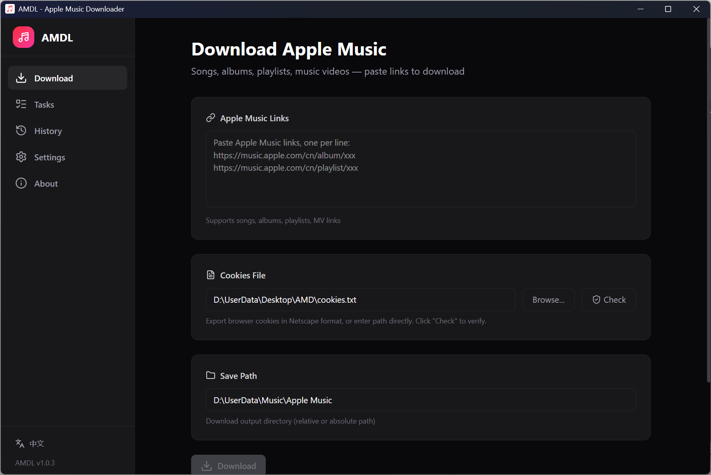

# AMDL - Apple Music Downloader

A desktop Apple Music downloader with a beautiful dark-themed Web UI, built on [gamdl](https://github.com/glomatico/gamdl).

[](https://github.com/DerekH-233/AMDL)
[](https://www.python.org/downloads/)
[](LICENSE)

Inspired by [wenfeng110402/AppleMusic-Downloader](https://github.com/wenfeng110402/AppleMusic-Downloader).



> **中文用户请阅读 [中文 README](README.md)。**

---

## Features

- **Songs / Albums / Playlists / Music Videos** — AAC 256kbps, ALAC lossless, Dolby Atmos, and more
- **Playlist Auto-Detection** — Automatically creates a folder named after the playlist, with song names only
- **Real-time Progress** — WebSocket-powered progress bar with per-track updates
- **Cookies Check** — One-click validation of cookies file and subscription status
- **Format Conversion** — Post-download conversion to MP3 / FLAC / WAV / AAC / OGG / ALAC
- **Lyrics Toggle** — Optionally disable synced lyrics download to save resources
- **Task Queue** — Queue multiple downloads, cancel anytime
- **Download History** — Auto-recorded with clear option
- **Persistent Config** — All settings saved and restored across restarts
- **Dark Theme** — Global dark UI

---

## Download

Get the latest version from [Releases](https://github.com/DerekH-233/AMDL/releases):

| File | Description |
|------|-------------|
| `AMDL_Setup_v1.0.0.exe` | Installer (recommended) — desktop shortcut & start menu |
| `AMDL_v1.0.0_portable.zip` | Portable — extract and run `启动.bat` |

> **Note**: Always use `启动.bat` to launch. It sets `PYTHONUTF8=1` required for non-English Windows systems.

---

## Usage

1. Export your Apple Music cookies in **Netscape format**
   - Firefox: [Get cookies.txt LOCALLY](https://addons.mozilla.org/en-US/firefox/addon/get-cookies-txt-locally)
   - Chrome/Edge: [Get cookies.txt LOCALLY](https://chromewebstore.google.com/detail/cclelndahbckbenkjhflpdbgdldlbecc?utm_source=item-share-cb)
2. Launch AMDL, click "Browse" to select `cookies.txt`, click "Check" to verify
3. Paste Apple Music links (songs, albums, playlists, music videos, artist pages)
4. Set output path, click "Download"
5. Switch to "Tasks" tab to monitor real-time progress

> **Requires a valid Apple Music subscription. For personal use only. Respect copyright.**

### Important Notes

- **Region Restrictions**: Ensure the song is available in your Apple Music account's region. For example, a US account cannot download songs exclusive to the China store. If you see "Resource Not Found (404)", check whether the track is playable in your account region.
- **Launcher**: Always use `启动.bat` to launch. Running `AMDL.exe` directly may cause encoding issues on non-English Windows.
- **Cookies Expiry**: Re-export your cookies file if it expires.

---

## Development

```bash
# Clone
git clone https://github.com/DerekH-233/AMDL.git
cd AMDL

# Backend
pip install -r requirements.txt

# Frontend
cd gui && npm install

# Dev mode (two terminals)
# Terminal 1: frontend dev server
cd gui && npm run dev
# Terminal 2: desktop app
python desktop.py

# Build
python build.py
```

---

## Tech Stack

| Layer | Technology |
|-------|------------|
| Download Engine | [gamdl](https://github.com/glomatico/gamdl) + [yt-dlp](https://github.com/yt-dlp/yt-dlp) |
| Backend | FastAPI + WebSocket + SQLite |
| Frontend | Next.js + TypeScript + Tailwind CSS |
| Desktop Shell | pywebview |
| Packaging | PyInstaller + NSIS |

## Acknowledgments

- [glomatico/gamdl](https://github.com/glomatico/gamdl) — Apple Music download engine
- [yt-dlp/yt-dlp](https://github.com/yt-dlp/yt-dlp) — Universal video downloader
- [wenfeng110402/AppleMusic-Downloader](https://github.com/wenfeng110402/AppleMusic-Downloader) — Project inspiration

## Disclaimer

This tool is for educational and research purposes only. Users must provide their own valid Apple Music subscription credentials and assume full responsibility for their actions. This project does not provide or store any copyrighted content.
